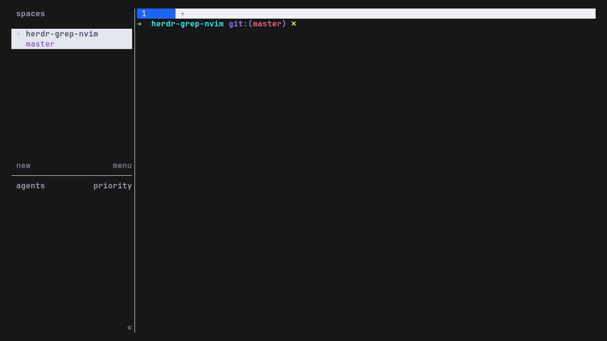

# grep-nvim

A [herdr](https://herdr.dev) plugin: **live-grep your repo with `fzf` + `ripgrep`,
then open the match in `nvim` — in a split beside your work.** Press the key, type,
watch results stream in with a `bat` preview, hit Enter, and you land in nvim on the
exact line. Quit nvim (or press Esc) and the split closes itself.

It never edits your files and runs nothing on its own — it only opens an editor on
the file you pick.



**Repo:** <https://github.com/cinco/herdr-grep-nvim> · install with `herdr plugin install cinco/herdr-grep-nvim` · [issues & PRs welcome](https://github.com/cinco/herdr-grep-nvim/issues)

## Requirements

- **herdr ≥ 0.7.0** (the plugin system)
- **[fzf](https://github.com/junegunn/fzf)** ≥ 0.35 — the picker
- **[ripgrep](https://github.com/BurntSushi/ripgrep) (`rg`)** — the search
- **nvim** (or any editor that accepts `+LINE file`; see [Configuration](#configuration))
- **[bat](https://github.com/sharkdp/bat)** — *optional*, for a syntax-highlighted preview (falls back to plain text)
- **Linux or macOS**

## Install

```bash
herdr plugin install cinco/herdr-grep-nvim
```

That registers the `grep-nvim.open` action. Then **bind a key** in your herdr config
(`~/.config/herdr/config.toml`) so one press summons it:

```toml
[[keys.command]]
key = "prefix+alt+f"
type = "shell"
command = "herdr plugin action invoke grep-nvim.open"
```

Run `herdr server reload-config`, then press your key. No key bound? Invoke it once with:

```bash
herdr plugin action invoke grep-nvim.open
```

## Usage

1. Press the key **inside a git repo / project** you're working in.
2. A pane splits to the **right** (at that repo's path) with a `grep>` prompt.
3. **Type** — ripgrep searches as you go; the match preview shows on the right.
4. **Enter** on a result opens it in **nvim at that line**.
5. Quit nvim (`:q`) — or press **Esc** in the picker — and the pane closes.

## Configuration

All optional, via environment variables (set them in your shell profile, or per
herdr pane):

| Variable | Default | Effect |
| --- | --- | --- |
| `GREP_NVIM_EDITOR` | `nvim` | Editor to open the match. Must accept `+LINE file` (vim/nvim). |
| `GREP_NVIM_RG_FLAGS` | *(none)* | Extra ripgrep flags, e.g. `--hidden -g '!.git'` or `-t py`. |
| `GREP_NVIM_DIRECTION` | `right` | Split direction: `right` or `down`. |

## How it works

Pure shell — no compiled binary, no build step:

- `herdr-plugin.toml` declares one action, `open`.
- `scripts/open.sh` reads the focused pane's cwd from `HERDR_PLUGIN_CONTEXT_JSON`,
  splits that pane (`herdr pane split --cwd <repo> --direction right --focus`), and
  runs the picker in the new pane via `herdr pane run "<pane>" "bash …; exit"`.
- `scripts/fzf-grep-nvim.sh` runs `fzf --disabled` with a `change:reload` bind that
  re-runs `rg` per keystroke, and `enter:become(nvim {1} +{2})` to open the pick.
  (`rg --column` output is `path:line:col:text`, so `{1}`=file, `{2}`=line.)

## Development

```bash
herdr plugin link /path/to/herdr-grep-nvim    # use this checkout directly (skips build)
herdr plugin action list --plugin grep-nvim
herdr plugin action invoke grep-nvim.open
herdr plugin log list --plugin grep-nvim      # see stderr from the action
```

## Publishing

This plugin lives at <https://github.com/cinco/herdr-grep-nvim> and carries the GitHub
topic **`herdr-plugin`**, so herdr's marketplace (<https://herdr.dev/plugins/>) indexes
it automatically — there is no review queue, and the index refreshes ~every 30 min.

Forking it? To list your own copy: push a **public GitHub repo** containing
`herdr-plugin.toml`, add the topic **`herdr-plugin`**, and install it with
`herdr plugin install <your-user>/<your-repo>`.

## License

MIT — see [LICENSE](LICENSE).
